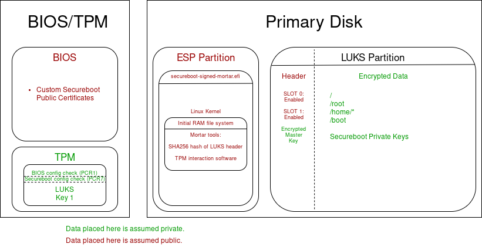

# Mortar  
Framework to join Linux's physical security bricks. 

## What is it?  
Mortar is an attempt to take the headache and fragmented processes out of joining Secureboot, TPM keys, and LUKS.  

Through the "Mortar Model" everything on disk that is used is either encrypted, signed, or hashed. Disks are automatically unlocked once the boot sequence has been validated, making this dramatically more convenient for end-users, and making LUKS on servers a viable option (as they can automatically unlock on reboot).  

Mortar aims to support both TPM 1.2 and 2 as well as LUKS1 and LUKS2 by intelligently selecting different implementation paths based on your current setup.  

Mortar aims to be distribution agnostic. Initial developments are on Arch Linux and Debian Linux.  

## How it works.  

  

Only 2 partitions on your primary disk are used: your UEFI ESP, and your encrypted LUKS partition. (You can leave your unencrypted boot partition if you like, but I'd highly recommend removing or disabling its automatic mount so that kernels and initram filesystems can reside encrypted on your LUKS partition.)  

You generate your own Secureboot keys. Only efi files you sign will successfully boot without resetting the BIOS.  

