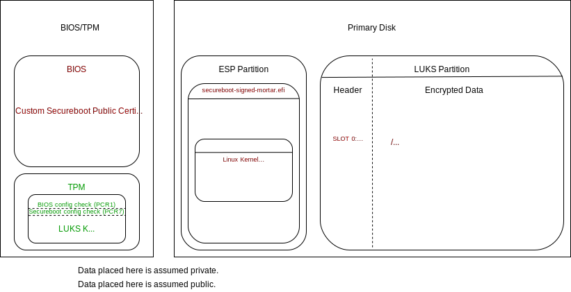

# Mortar  
Framework to join Linux's physical security bricks. Mortar is essentially Linux-native TPM-backed Bitlocker.  

|          | LUKS1 | LUKS2 | TPM1.2 | TPM2 (clevis) | TPM2 (non-clevis) |
|----------|-------|-------|--------|------|------|
| [Debian](docs/debian-install.md)   | *     | X     | X      | X    |      |
| [CentOS](docs/centos-install.md)   | !     |       |        | !    |      |
| Arch     | X    | *      |        | X    |      |
| OpenSUSE |       |       |        |      |      |
| Fedora   |       |       |        |      |      |  
| [Ubuntu](docs/ubuntu-install.md)   | X      | *     |        | X      |      |  

**If your distro is a link above, read the page behind that link before attempting to install mortar.**  
*=insufficiently tested, but presumed working  
!=in progress

## What is it?  
Mortar is an attempt to take the headache and fragmented processes out of joining Secureboot, TPM keys, and LUKS.  

**Through the "Mortar Model" everything on disk that is used is either encrypted, signed, or hashed.** The TPM is used to effectively whitelist certain boot states. Disks are automatically unlocked once the boot sequence has been validated. This makes full-disk encryption dramatically more convenient for end-users and viable on servers (as they can automatically unlock on reboot).  

Mortar aims to support both TPM 1.2 (via its own implementation) and TPM 2 (via clevis).

LUKS1 and LUKS2 are both supported.  

Mortar aims to be distribution agnostic. Initial developments are on Arch Linux and Debian Linux.  

Security note with TPM2: Clevis allows anyone with root access to fetch sufficent private data to decrypt the drive. Protect the root account. With TPM1.2 Mortar leverages READ_STCLEAR to make this more difficult (thanks morbitzer). I'm investigating a way to make tpm2 work *without* clevis down the road.  

Note on updates: Unless there is a security issue that is remediated by a newer version of this framework, I highly advise that you _not_ upgrade unless you are experiencing issues. If your system works, decrypts, and survives kernel and initramfs upgrades, leave it. The majority of changes here are for new supported distros, development scalability, and streamlining of data ingestion that may be incompatible with the version of mortar you are using. If you've freshly installed, by all means pull the latest version and use it. If you're sitting pretty, stay put. <3  

## How it works.  

  

Only 2 partitions on your primary disk are used: your UEFI ESP, and your encrypted LUKS partition. (You can leave your unencrypted boot partition if you like, but I'd highly recommend removing or disabling its automatic mount so that kernels and initram filesystems can reside encrypted on your LUKS partition.)  

You generate your own Secureboot keys. Only efi files you sign will successfully boot without modifying the BIOS (and breaking PCR1 validation). 

## FAQ/Troubleshooting/Things To Watch For.  
If the EFI fails to boot, but external media still works: Make sure you enroll the hashes of your RAID cards and other media. The Dell BIOS on the R730 I tested with had a convenient way of doing this in the secureboot>custom>db>enrollment section of the BIOS. Authorizing hashes this way SHOULD (did on my system, make sure yours does!) change your PCR7 value, so check that and rebind your TPM state using the luks script if you make this change.  

TPM 1.2 errors accessing the index during boot: If using TPM 1.2, do not use "troublesome" characters in the Owner Password that would potentially cause errors when stored in a variable. Examples would include "/\$()*| " and such. Please *DO* make the passwords complex though. By re-running the luks script, you can opt to "own" the TPM device and change this password.  

## Installation (Debian with TPM 2 and LUKS 2 used for reference below).  

### Install Debian.  
I used the netboot install method and let it configure most things for me. I selected the encrypted lvm on luks option and accepted all the default configurations.  

This gave me:  
Partition1: ESP 512MB  
Partition2: /boot 256MB  
Partition3: Encrypted LUKS (remainder of disk)  
  --> LVM /root (remainder -swap)  
  --> LVM swap (up to 8GB)  

As I mentioned earlier, we should **not** be using an unencrypted /boot when we're done.  

For your reference, this defaulted to xts-aes512. I'd recommend either using xts-aes512 (security-leaning sweet spot) or xts-aes256 (performance-leaning sweet spot) but that's up to you.  

You can test your expected performance of each with:  
    cryptsetup benchmark  

## Install the prerequisite software.
Do this as root in a directory only root can access. (I typically use /root/git at this stage.)  

Install git and git clone this project.  

    apt-get update && apt-get install git
    git clone https://github.com/noahbliss/mortar
    cd mortar
    ./0-initialsetup-prereqinstall.sh  

DON'T FORGET TO INSTALL THE TPM-VERSION-SPECIFIC PACKAGES THAT ARE ECHOED AT THE END.  
At this point you should have your /etc/mortar/mortar.env file generated and installed. Change any values that you'd like.  
/usr/local/sbin/mortar-compilesigninstall should also be installed.  

## Generate your secureboot keys.  
This spits out PEM formatted keys. If the script to install them fails, you may need to manually install them in your BIOS. Most BIOSes take DER format. You can convert them with the openssl command.  

    ./1-generatesecurebootkeys.sh  
Keys are written to /etc/mortar/private with sane permissions. The next command that sources mortar.env will further restrict these permissions.  

## Generate your first signed EFI file.  
Now it is time to merge your kernel, initramfs, and kernel command line options into a single EFI file and sign that file with your secureboot keys. 

This script has several options.  

The following command will generate the Mortar signed efi using a kernel and initramfs and use efibootmgr to attempt to install a boot entry for the resulting file:  

    mortar-compilesigninstall /path/to/vmlinuz-kernel-image /path/to/initramfs.img --install-entry  

You can also run it without the `--install-entry` to just generate the file.  

You can also run it interactively:  

    mortar-compilesigninstall --interactive  

## Reboot and ensure that the new EFI file boots correctly.  
Exactly what it says. If you opted against/efibootmgr failed to automatically install the boot entry, you should now add the EFI to your BIOS's boot list.  

## Set up Secure Boot.

Measure TPM PCR values and store for later comparison.  
 - TPM2: `tpm2_pcrlist` Look at 7 and 1 especially.  

Reboot into the BIOS:  
 - Put your BIOS's Secure Boot setting into "Audit" mode if possiblem then reboot into your OS and run `./2-`. If it does not have an audit mode, you will need to manually install your Secure Boot keys. They are located in /etc/mortar/private/*.crt you _may_ need to convert them to DER format first.  
 - Enroll any hashes that need to be enrolled (especially if booting from a raid-controller-hosted disk, system may not boot without this. NVIDIA proprietary graphics may also cause issues.).  
 - Put a password on the BIOS.  
 - Boot the system with secureboot on (and pray).  

 - Measure PCR values now that secureboot is set up. (PCR7 may be the same depending on if you enrolled additional hashes or not, PCR1 should have changed since BIOS settings were modified.)  
 - optional steps:  
    - Regenerate the signed EFI. This will move the first one to .old.  
    - Reboot, and reread the PCR values. This will let you see what stays the same when booting different EFI files that are both validly signed.  

## Set up the TPM-Stored LUKS Key.
 
 - Make sure you've set a BIOS password and made any necessary settings changes to your BIOS before the next step.  
 - Run the luks script for the TPM version being used. `./3-`  
 - Update initramfs. (done by the script)  
 - Regenerate EFI.  
 - Reboot and pray.  
 - If it all works, then you just booted to a login prompt with the disk being automatically decrypted.  

## Remove boot partition risk.
`mkdir /boot2`  
If EFI partition is inside /boot unmount it.  
`umount -l /boot/efi`  
Copy /boot contents to /boot2  
`cp -r /boot/* /boot2`  
unmount /boot  
`mv /boot2 /boot`  
**Remove /boot from /etc/fstab**  
remount your EFI partition if it was inside /boot  
`mount -a`  
Optionally regenerate your EFI just to make sure it can still find your kernel and initramfs.  

## TODO:  
Add functionality that stores an OTP private key in the TPM instead of a LUKS key. This would allow an end user to leverage a TPM for boot integrity checking without having to trust it to securely store keys.  

Investigate feasibility of storing the entire luks header in the nvram of the TPM module.  

## Uninstallation:  
I'll preface this with "highly unrecommended/proceed at your own risk."  
At a high level, you'll want to do the following:  
  - Boot to BIOS, disable secureboot.
  - Restore your old boot directory and use efibootmgr or your BIOS to reconfigure your system to boot with your old bootloader (likely grub).
  - TEST THAT YOUR OLD BOOTLOADER WORKS (reboot with it).
  - Remove mortar (git directory, /etc/mortar, /usr/local/sbin/mortar-compilesigninstall, and .efi files in your ESP partition, likely under /boot or /efi somewhere)
  - Done

## Security:  
Please refer to [the Security tab](../../security) for information regarding vulnerability disclosure and remediation.  

## Wrapping Up:  
Mortar is, like most software "distributed as-is without claims of fitness for a specific purpose, yada yada." TL;DR if the 3-letter agencies of the various super powers want to get you, don't blame me if they succeed. That said, assuming your adversary doesn't have backdoors in your CPU/motherboard/BIOS firmwares, Mortar _may_ make "getting you" substantially more difficult. Don't use it for evil stuff.  

Mortar is social! There is a Telegram group for discussing Mortar available at [t.me/linuxmortar](https://t.me/linuxmortar)  
I can't promise I'll always be able to play tech support there, but discussion and tips are absolutely encouraged.  

